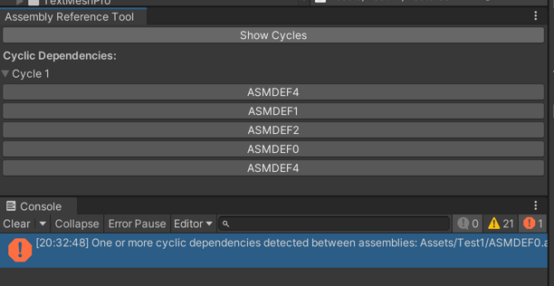

# SB Assembly Reference Cycle Detector

A Unity Editor tool for detecting cyclic dependencies in Unity projects.



## Installation
```"com.sb.asmdef-cycle-detectorr": "https://github.com/shaharbar2/SBAssemblyCycleDetector.git?path=/Packages/com.sb.asmdef-cycle-detector#main"```

OpenUPM `openupm add com.sb.asmdef-cycle-detector`

https://openupm.com/packages/com.sb.git-repo-creator/
## Features

- **Cycle Detection:** Identifies cyclic dependencies between assembly references in a Unity project.
- **User Interface:** Provides a user-friendly GUI in the Unity Editor for easy navigation and use.
- **Assembly Selection:** Enables users to analyze specific assemblies within their project.
- **Visual Feedback:** Displays the detected cycles in a clear, understandable format.
- **Direct Navigation:** Offers the ability to directly select and highlight the problematic `.asmdef` files in the Unity Editor.

## How to Use

1. **Open the Tool:** In Unity, navigate to `SBTools > Assemblies Cycle Detector` to open the tool window.
2. **Detect Cycles:** Click on 'Show Cycles' to start the detection process.
3. **View Results:** Examine the listed cycles, if any, and navigate to the relevant assembly definitions for resolution.

## Requirements

- Unity 2020.1 or higher is required.
- The tool is intended for use within the Unity Editor environment.

## Contributions

For bug reports, feature requests, or contributions, please visit `https://github.com/shaharbar2/SBAssemblyCycleDetector`. Forks and Pull Requests are welcome.

## License

This tool is distributed under the MIT License. See the included LICENSE.md file for more details. For the license text, see [LICENSE.md](LICENSE.md).
